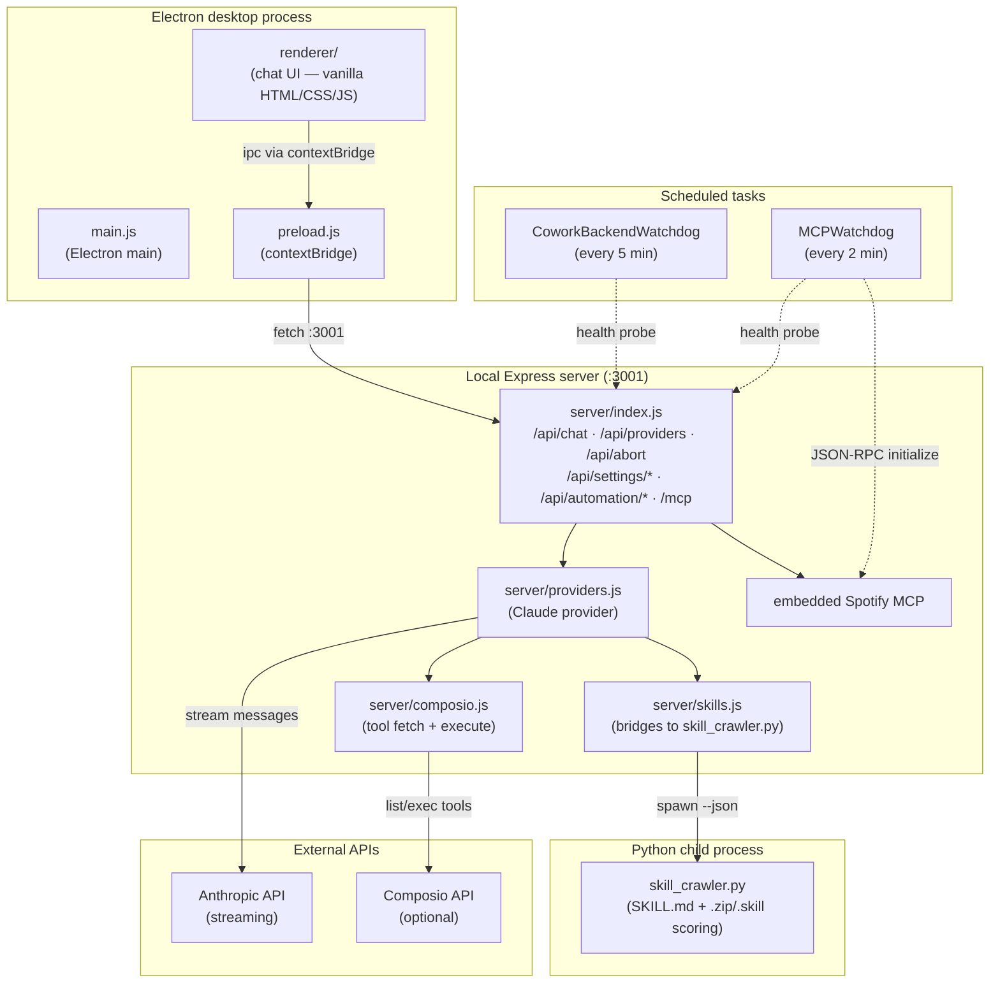
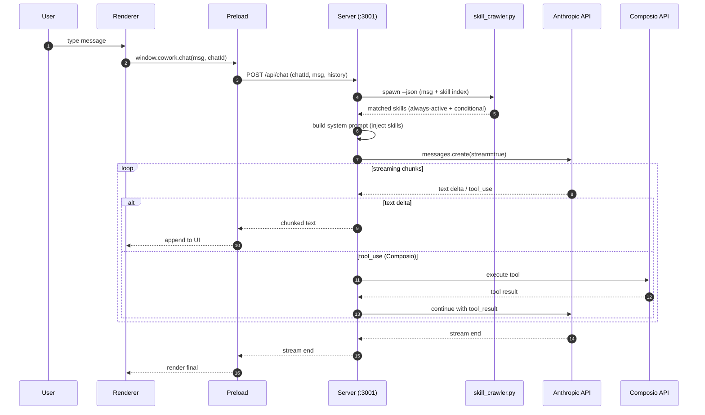
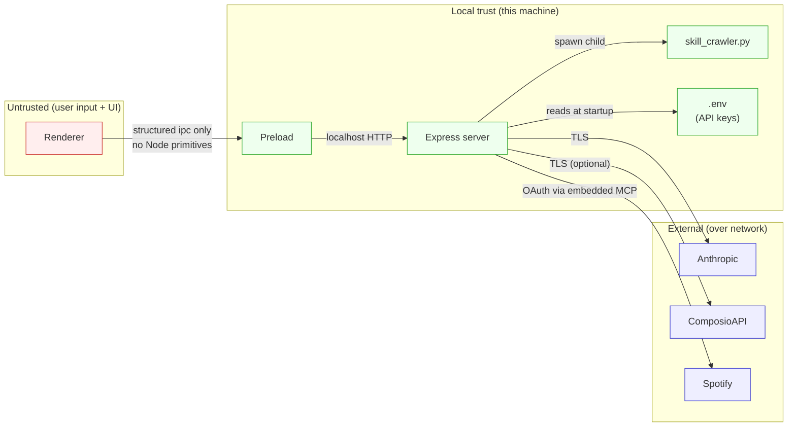

# Architecture

This document describes the runtime architecture of **Open Claude Cowork**:
how the Electron shell, local Express backend, Claude provider, Composio tool
router, and the Python skill crawler fit together; the chat request lifecycle;
and the trust boundaries between components.

## Components

### Process model

- **Single Electron process** owns the desktop window. The renderer is
  isolated from Node — only the methods exposed via `preload.js`'s
  `contextBridge` cross the boundary.
- **The Express server is a separate Node process** spawned by `npm run server`
  (or by the watchdog if the port goes dark). It is the only process that holds
  API keys and talks to external services.
- **The skill crawler is a short-lived Python child process** spawned per
  request via `server/skills.js`. It returns JSON and exits.

## Chat request lifecycle

Notes on this flow:

- **Streaming** is `Transfer-Encoding: chunked` plain text, **not** SSE.
- **Composio is optional**: if `COMPOSIO_API_KEY` is missing, the tool path
  short-circuits and the model is given no tools.
- **Per-`chatId` history** is held server-side, capped at 50 messages, and
  evicted after 2 hours of idle time.
- **Aborts** route through `/api/abort`, which signals the in-flight
  Anthropic stream to cancel.

## Trust and data boundaries

### Boundaries enforced by code

- **Renderer ↔ Preload**: `contextIsolation: true`. The renderer has no
  Node, no `require`, no filesystem. Only what `preload.js` chooses to expose.
- **Preload ↔ Server**: `fetch` to `http://localhost:3001`. The server
  treats incoming bodies as untrusted: input validation, output escaping,
  allowlists for skill names and provider IDs, path-traversal guards on
  any filesystem-touching skill calls.
- **Server ↔ External APIs**: API keys are loaded from `.env` once at startup
  and never serialized into a response body. `ANTHROPIC_API_KEY` is required;
  `COMPOSIO_API_KEY` is optional.
- **Server ↔ Python**: arguments to `skill_crawler.py` are constructed from
  validated server state, not raw renderer input. The crawler returns JSON
  only and does not execute caller-supplied code.

### Files that hold secrets

- `.env` (git-ignored). Created from `.env.example` during `setup.sh`.
- `~/.claude/mcp-needs-auth-cache.json` — MCP auth tokens. Pruned by
  `mcp_watchdog.ps1` after 30 days of inactivity.

### Offline-only sub-app

`visualization/` (Smilee) is a hard-rule offline subsystem — no network calls
under any circumstance. It is excluded from the security scope in
`SECURITY.md`.

## Operational architecture

### Watchdogs

Two scheduled tasks keep the local stack healthy without manual intervention:

- **`CoworkBackendWatchdog`** (`scripts/cowork_watchdog.ps1`, every 5 min) —
  HTTP-probes `:3001/api/providers`. On failure, kills any orphaned listener
  on `:3001` and re-launches `npm run server` detached.
- **`MCPWatchdog`** (`scripts/mcp_watchdog.ps1`, every 2 min) — probes every
  HTTP MCP listed in `.mcp.json` with a JSON-RPC `initialize`, restarts the
  cowork backend when an MCP that lives on `:3001` is wedged, and prunes
  stale entries from the auth cache.

Both run via `wscript.exe scripts/run_hidden.vbs <script.ps1>` so PowerShell
opens with no console flash. Logs are written to
`scripts/cowork_watchdog.log` and `scripts/mcp_watchdog.log`.

### Skill loading

- Skills under `SKILL.MD/` and `Skills.md/` directories, plus any `.zip` /
  `.skill` archives in known skill paths, are indexed by `skill_crawler.py`
  on each chat request.
- Always-active skills (`clarifying-questions`, `truthfinder`) are injected
  unconditionally into the system prompt.
- Conditional skills are scored by keyword + synonym match against the
  current user message; matches above threshold are appended to the system
  prompt.

## Tech stack summary

| Layer        | Tech                                    |
| ------------ | --------------------------------------- |
| Desktop      | Electron 33.x                           |
| Backend      | Node 18+, Express, Anthropic SDK         |
| Tool routing | Composio (optional)                     |
| Skills       | Python 3.10+ (`skill_crawler.py`)        |
| Frontend     | Vanilla HTML/CSS/JS (no framework)       |
| Build        | `concurrently` + `cross-env` for dev     |
| Watchdogs    | PowerShell + Windows Task Scheduler      |
