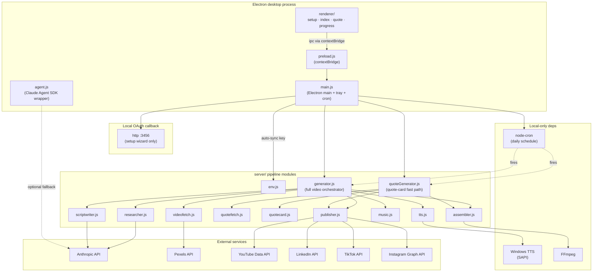
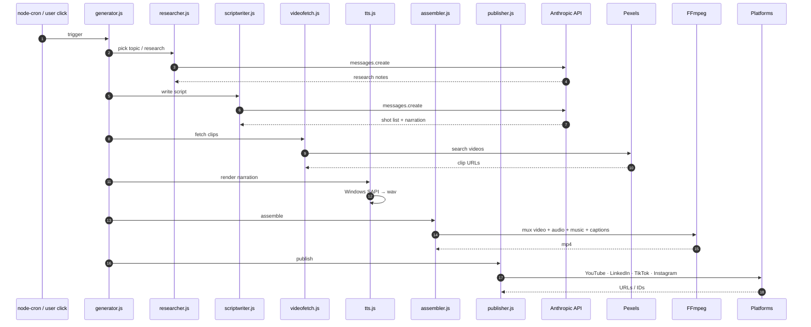
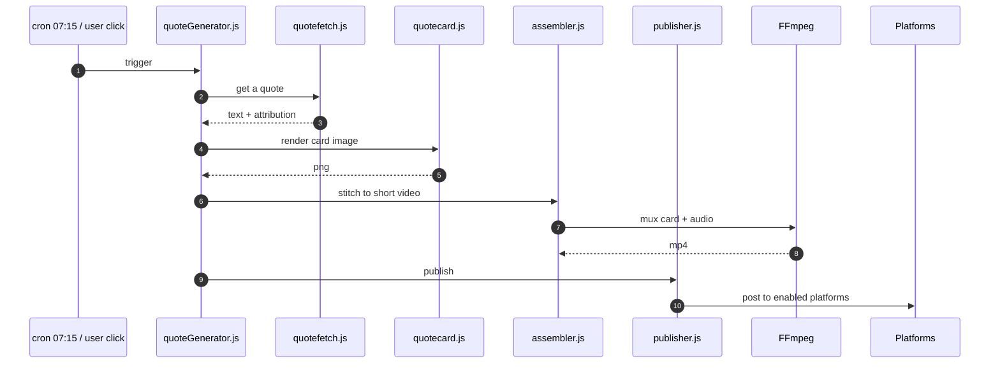
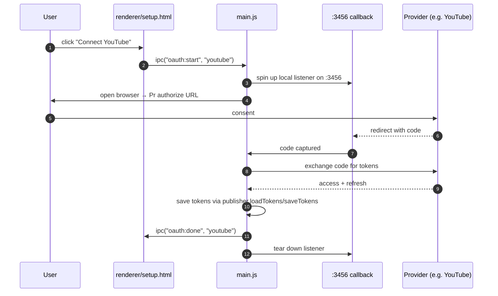
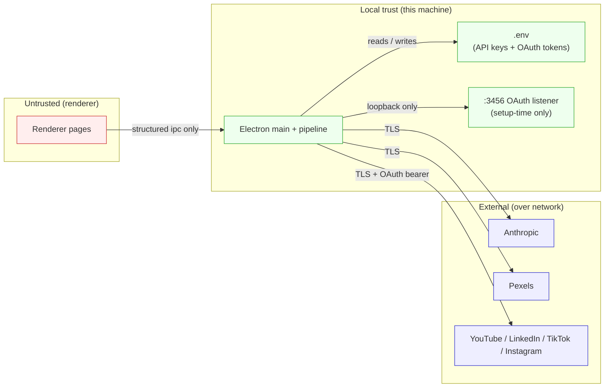

# Architecture

This document describes the runtime architecture of **Motivate**: how the
Electron shell, generator pipeline, OAuth callback server, and the daily
`node-cron` scheduler fit together; the end-to-end video generation
lifecycle; and the trust boundaries between components.

## Components

### Process model

- **Single Electron process** owns the desktop window(s): a system tray, a
  setup wizard (`setup.html`), the daily prompt UI (`index.html`), the
  quote-card fast-path UI (`quote.html`), and progress UIs.
- The renderer is isolated from Node — only methods exposed via
  `preload.js`'s `contextBridge` cross the boundary.
- **Pipeline modules** run inside the Electron main process. There is no
  separate backend server — the OAuth callback is the only HTTP listener.
- **Daily generation is driven by `node-cron`** scheduled in `main.js`
  (`POST_HOUR` / `POST_MINUTE` for the full video; `07:15` for the
  quote-card fast path).

## Lifecycles

### Full motivational-video lifecycle

### Quote-card fast-path lifecycle

The quote pipeline does **not** require an Anthropic key — it falls back to
local quote generation and a static-card render.

### One-click OAuth setup

## Trust and data boundaries

### Boundaries enforced by code

- **Renderer ↔ Main**: `contextIsolation: true`. The renderer has no Node,
  no `require`, no filesystem. Only methods exposed by `preload.js` cross
  the boundary.
- **Main ↔ External APIs**: API keys and OAuth tokens are loaded from
  `.env` (or auto-borrowed from the parent project's `.env` for
  `ANTHROPIC_API_KEY`) and never serialized into a renderer message.
- **OAuth listener** is bound to `127.0.0.1:3456` and only runs while the
  setup wizard is actively brokering a connection — torn down immediately
  after the code exchange completes.

### Files that hold secrets

- `.env` (git-ignored) — every API key and OAuth token listed in
  `.env.example`.
- The parent project's `.env`, read **only** for `ANTHROPIC_API_KEY` to
  avoid duplicating the key.

## Operational architecture

### Daily schedule

```mermaid
gantt
  title Daily run (default schedule)
  dateFormat HH:mm
  axisFormat %H:%M
  section Quote pipeline
  Quote card                :07:15, 5m
  section Video pipeline
  Research + script         :09:00, 2m
  Fetch + TTS + assemble    :09:02, 5m
  Publish to platforms      :09:07, 2m
```

`POST_HOUR` and `POST_MINUTE` in `.env` override the video-pipeline start
time. The quote fast path is currently fixed at `07:15` in `main.js`.

### Tray + windows

`main.js` runs as a tray app. The tray menu opens the setup wizard, the
daily-video prompt, or the quote-card window on demand. None of the
windows are required to be open for the cron schedule to fire.

## Tech stack summary

| Layer        | Tech                                        |
| ------------ | ------------------------------------------- |
| Desktop      | Electron 28.x                                |
| AI           | `@anthropic-ai/sdk` (Claude)                 |
| Stock video  | Pexels API (`axios`)                         |
| TTS          | Windows SAPI (local, no network)             |
| Assembly     | `fluent-ffmpeg` + system FFmpeg              |
| Publishing   | `googleapis` for YouTube; per-platform REST  |
| Scheduling   | `node-cron`                                  |
| Frontend     | Vanilla HTML/CSS/JS                          |
