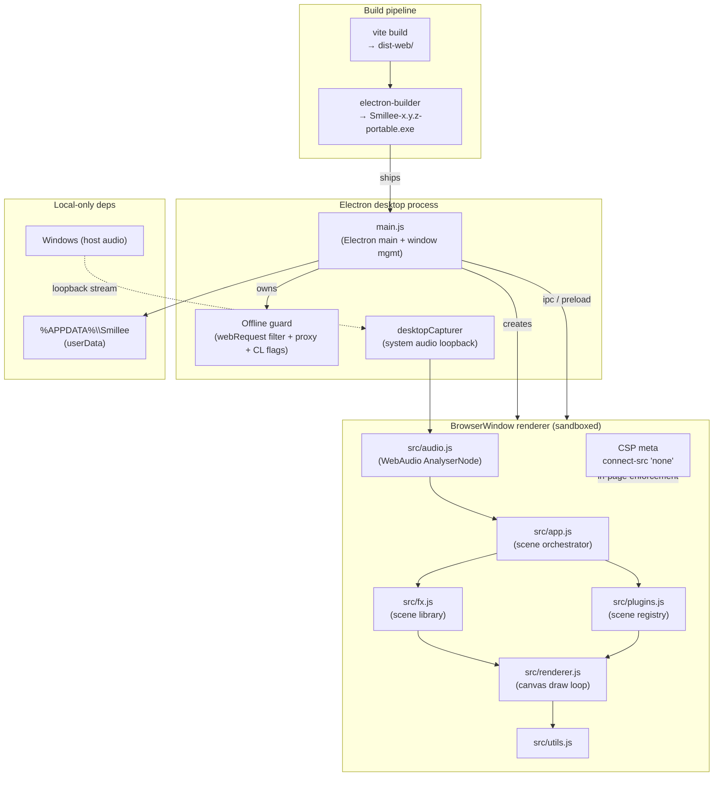
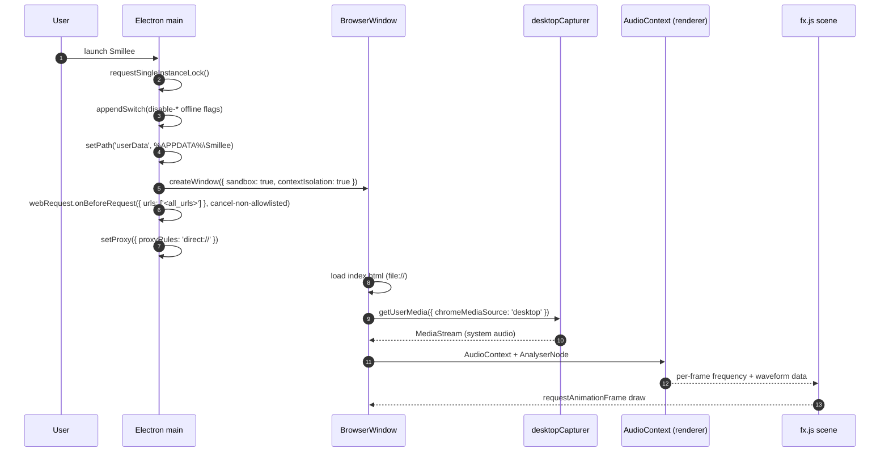
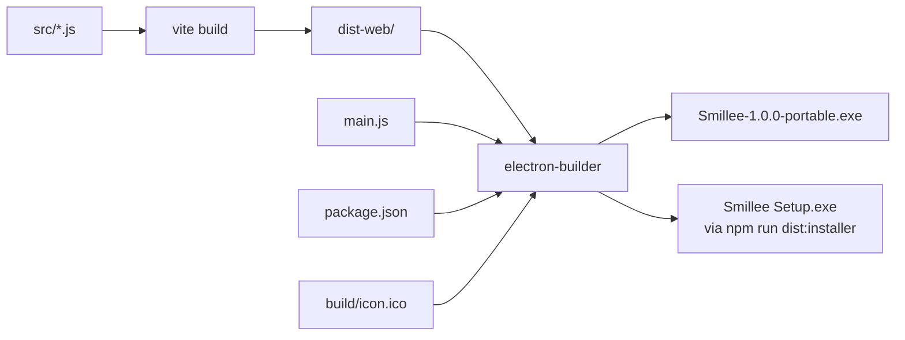

# Architecture

This document describes the runtime architecture of **Smillee**, a
music-reactive desktop visualizer that captures system audio via loopback
and renders animated reactive scenes in a sandboxed `BrowserWindow`.

The defining constraint is the **offline invariant**: a packaged Smillee
build must run with the network cable unplugged and produce zero outbound
traffic. The architecture is shaped end-to-end by that constraint.

## Components

### Process model

- **Single Electron process** owns the visualizer window. There is no
  backend server, no helper process, no IPC across machines.
- **Renderer is sandboxed**: `contextIsolation: true`, `nodeIntegration: false`,
  `sandbox: true`, `webSecurity: true`, `experimentalFeatures: false`,
  `spellcheck: false`. DevTools are blocked entirely in packaged builds.
- **Single-instance lock** (`app.requestSingleInstanceLock()`) — a second
  launch focuses the existing window instead of spawning a duplicate that
  would fight for the loopback stream.
- **User-data dir** is forced to `%APPDATA%\Smillee` so a portable `.exe`
  persists state across runs (the extraction temp dir is wiped on every
  launch). A development-mode fallback writes to a project-local
  `.electron-data/` if `appData` is locked down by ACLs.

## Data boundaries (trust model)

| Boundary | Direction | Mechanism | What's enforced |
|---|---|---|---|
| Host OS → Smillee | inbound | `desktopCapturer` loopback | Smillee captures audio that's already playing on the host. No microphone access; no Spotify Web API access. |
| Smillee → Internet | outbound | **blocked** | Cancelled at four layers: command-line flags, CSP, `webRequest.onBeforeRequest`, dead proxy. See [SECURITY.md](SECURITY.md). |
| Renderer ↔ Main | bidirectional | `contextBridge` (preload — none currently) | Smillee's renderer is purely visual; no Node bridge has been exposed yet. The boundary is enforced even though it's not crossed. |
| Smillee → Filesystem | outbound | `userData` only | Reads/writes confined to `%APPDATA%\Smillee` and the bundled `dist-web/` shipped inside the asar. |
| Vite dev server → Renderer | inbound (dev only) | `http://localhost:5173` | Allowlisted in dev only. Production builds load from `file://` and never see localhost. |

## Lifecycles

### Cold-start lifecycle

### Offline-leak detection (defensive logging)

Any URL that reaches `webRequest.onBeforeRequest` and fails the allowlist
regex is logged with `console.log('[offline-block]', method, url)` before
being cancelled. In dev (`!app.isPackaged`) this surfaces in the DevTools
console; in packaged builds it surfaces via `npx electron --inspect` only.

The expected log volume in a healthy build is **zero**. A non-zero count is
a SECURITY-tagged regression.

## Build pipeline

- **Vite** bundles `src/*.js` → `dist-web/assets/*.js` with content-hashed
  filenames so cache invalidation is automatic between builds.
- **electron-builder** packages `main.js`, `index.html`, `package.json`,
  `src/**`, `dist-web/**`, and `build/icon.ico` into an asar archive,
  excluding `.electron-data/`, `.chrome-profile/`, `dist/`, and
  `node_modules/`.
- The default target is a portable `.exe` (`Smillee-${version}-portable.exe`)
  with `compression: maximum`. An NSIS installer target is also configured
  (`npm run dist:installer`) but not the default.

## Why this shape

- **No backend** — every architectural temptation to phone home (telemetry,
  auto-update, license check, Spotify Now-Playing) violates the offline
  invariant. A backend is not on the roadmap.
- **No `shell.openExternal`** — the navigation handler intentionally
  *silently denies* external URLs rather than handing them to the system
  browser. Smillee must never cause any program (itself or another) to
  make a network connection.
- **DevTools blocked in packaged builds** — DevTools is the obvious
  exfiltration path (a curious user can paste `fetch('https://...')` into
  the console). Closing it on every open event is belt-and-braces above
  the `webPreferences.devTools: false` setting that already disables it.
- **Vite bundle, not raw script tags** — the renderer needs ES modules and
  hot-reload during development. Vite's `dist-web/` output remains a
  static `file://`-loadable bundle for production, so the offline
  invariant holds.
